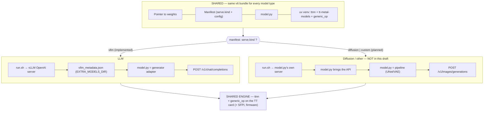

<!-- SPDX-License-Identifier: Apache-2.0 -->
<!-- SPDX-FileCopyrightText: 2026 Tenstorrent USA, Inc. -->
# Thin (v6) model packages — DRAFT

> **Status: draft / scaffold.** This reflects the plan in **issue #29**. It becomes fully installable
> once the **models wheel** is published. That work is in progress upstream as **`tt-metal-models`**
> — [tenstorrent/tt-metal#54340](https://github.com/tenstorrent/tt-metal/pull/54340) — which packages
> the whole `models/` tree (**including `tt_transformers`**) for pip/apt/dnf and **pins `ttnn` exactly**
> (`tt-metal-models==X` ⇒ `ttnn==X`). So a thin bundle pins **one** dep (`tt-metal-models`) and the
> matching `ttnn` comes transitively — it likely subsumes a separate "TTTv2" wheel. Until it lands,
> the generated `requirements.txt` pins `ttnn` directly (it's on PyPI). See #29 for the full design.

A **thin (v6) bundle** keeps the self-contained wall between models — its own uv-managed venv — but
builds that venv from **pip dependency pins + a tiny models wheel** instead of embedding the full
platform. There is **no embedded `ttnn` wheel and no `metal/` tree**.

## What a thin bundle contains
```
<org>/<model>/
  tt_kernel_manifest.json     # schema_version "6"; carries a `deps` block (below)
  model.py                    # the runner; `--main-class module:Class` resolves it (PYTHONPATH=$HERE)
  requirements.txt            # pip pins: tt-metal-models (incl. tt_transformers; pins ttnn exactly) · custom ops · ...
  wheels/                     # bundled wheels installed BY PATH: vllm-tt-plugin (the vLLM
                              # integration — no custom vLLM fork) + any generic_op custom-op wheel
  vllm_models/<name>/vllm_metadata.json   # EXTRA_MODELS_DIR contract (arch -> main_class)
  install.sh  run.sh
  # weights: NOT embedded — HF pointer in the manifest
```

## Manifest `deps` block (schema 6)
- `python` — pinned interpreter (uv provisions it into the bundle)
- `requirements` — the pins file (default `requirements.txt`)
- `wheels` — bundle-relative wheels installed **by path** (vllm-tt-plugin, then any generic_op wheels)
- `wheels_dir` — the dir holding them (`wheels`), also put on `--find-links`
- `model_dir` — where `model.py` lives (default the bundle root) → PYTHONPATH at serve

## Install / serve
`install.sh` builds the venv with uv: `uv venv --relocatable --python <pin>`, then
`uv pip install [--find-links wheels] <bundled wheels by path> -r requirements.txt` — the bundled
wheels (vllm-tt-plugin + ops) install by path, `requirements.txt` pulls ttnn/tt-metal-models
from the index. `run.sh` wires the engine env
(`LD_PRELOAD` of `_ttnncpp.so`, `TT_METAL_HOME` at the installed `ttnn`, `EXTRA_MODELS_DIR`,
hermetic caches under the folder) and launches vLLM — `PYTHONPATH=$HERE` so `model.py` imports.
`tt-model pull` / `serve` route a thin bundle through the same install/serve path as a v5 fat one.

> **On `run.sh`:** the serving launcher is a generated `run.sh`, and `tt-model serve` runs
> `bash <bundle>/run.sh`. It's a shell wrapper (not Python in `serve`) on purpose: `LD_PRELOAD` of
> `_ttnncpp.so` must be set **before** the interpreter starts, so it can't be done from inside
> tt-model's own process. `run.sh` also makes the bundle runnable without tt-model (`bash run.sh`);
> `tt-model serve` is the managed wrapper. The author doesn't write it — `package`/`package-thin`
> generate it; the author writes `model.py`.

## Serving front end — LLM today, other model types later (NOT in this draft)

The engine + bundle + install are **modality-agnostic** and shared. The one modality-specific layer
is the **serving front end**, which in v6 today is **vLLM only** (`run.sh` launches vLLM's OpenAI
server; the `vllm_metadata.json` / `EXTRA_MODELS_DIR` registration is LLM-specific).

Supporting diffusion / other model types is a **future extension** — a `serve.kind` on the manifest
that `render_run_sh` dispatches on (e.g. `vllm` today; a `custom` kind where `run.sh` launches
`model.py`'s own server). That needs a new serving contract + a `model.py` runner protocol + a
different API surface, so it is **deliberately out of scope for this draft** (tracked in #29) — not a
drop-in. The shape it would take:



The **diffusion model code** itself would live in `tt-metal-models`, not tt-model — the engine
already runs it; only the serving layer is the gap.

## Box prerequisites
A TT **card**, its **firmware/driver**, and **SFPI** (SFPI is a separate, externally-managed box
dependency — provisioned by tt-cli, or installed by the user on a bare box; it is **not** in `ttnn`
and **not** in the venv). No separate tt-metal install — the tt-metal runtime rides inside `ttnn`.

## Author a thin bundle — from a "works on my box" model

A thin package is not the engine; it's a thin description of *your* model plus the recipe to rebuild
its venv anywhere. "Making the package" = capturing the exact recipe your working box used.

### What "working on my box" must already include → where it lands
| You have (working box) | Becomes (in the package) |
|---|---|
| `model.py` — your runner, built on the `tt_transformers` blocks (from `tt-metal-models`) and/or calling `ttnn.generic_op` for custom ops | shipped at the bundle root |
| the **exact dep versions** you ran with — `tt-metal-models==…` (pulls the matching `ttnn`), any custom-op wheel | `requirements.txt` pins |
| the **`vllm-tt-plugin`** wheel (the vLLM integration — no custom vLLM fork) | `wheels/`, installed by path |
| *(if you wrote custom ops)* a **`generic_op` wheel** you built | `wheels/`, installed by path |
| the **serving entrypoint** — the HF architecture name + the `module:Class` the vLLM plugin loads | `vllm_metadata.json` (`arch` → `main_class`) |
| the **weights** (an HF repo id) + the **serving knobs** you validated (mesh, max_num_seqs, block_size) | manifest pointer + `resources`/`mesh` |

The key discipline: **pin what actually worked** — `pip freeze` in your working venv gives the real
`tt-metal-models` (and, until it lands, `ttnn`) version to put in `requirements.txt`.

### Steps
1. **Make `model.py` importable by its class path.** Class `QwenForCausalLM` in `model.py` → the
   entrypoint is `model:QwenForCausalLM` (module = filename without `.py`; at serve time `PYTHONPATH`
   is the bundle root).
2. **Write `requirements.txt`** with the versions your box ran:
   ```
   # tt-metal-models==<X>       # the models tree (incl. tt_transformers); pins ttnn==<X> exactly
   #                            # (upstream tt-metal#54340) — pulls the matching ttnn transitively
   ttnn==0.77.0                 # engine (PyPI today; pin directly until tt-metal-models lands)
   ```
   **vLLM: stock vLLM + the plugin — no custom vLLM fork.** The vLLM *integration* is the
   [`vllm-tt-plugin`](https://github.com/tenstorrent/vllm-tt-plugin); ship it as a bundled wheel
   (below). Don't hand-pin CUDA `vllm`; vLLM core comes via the plugin.
   SFPI + firmware are external box deps — **not** in `requirements.txt`. (Omit `--requirements` and
   `package-thin` writes this as a template with the `tt-metal-models` TODO pin.)
3. **(Custom ops only)** put your built `generic_op` wheel in a folder, e.g.
   `model.py` calls `ttnn.generic_op(...)` to use it; ship it with `--ops-wheel`.
4. **Run `package-thin`:**
   ```bash
   tt-model package-thin <org>/<model> \
     --model-py ./model.py \
     --requirements ./requirements.txt \      # your pins (or omit for the #29 TODO template)
     --plugin-wheel ./wheels/vllm_tt_plugin-*.whl \   # vllm-tt-plugin (the vLLM integration)
     --ops-wheel ./wheels/my_model_ops-*.whl \  # optional: your generic_op wheel (repeatable)
     --arch blackhole \
     --arch-name QwenForCausalLM --main-class model:QwenForCausalLM \
     --weights Qwen/Qwen3-4B \                # pointer, never embedded
     --mesh P150 --max-num-seqs 32 --block-size 64 \
     --out ./bundle                           # stage locally (omit + pass <org>/<model> to push)
   ```
5. **Result** — the bundle layout shown above (`model.py` + `requirements.txt` + `wheels/`
   [vllm-tt-plugin + ops] + `vllm_models/<name>/vllm_metadata.json` + manifest + `install.sh`/`run.sh`;
   no `metal/`, no embedded ttnn wheel, no vLLM fork).
6. **Round-trip** — on any card + firmware + SFPI box: `tt-model pull <org>/<model>` builds the venv
   from `requirements.txt` and fetches the weights; `tt-model serve <org>/<model>` launches it.

**Required from you:** `model.py` + a `requirements.txt` of real pins + *(optional)* a `generic_op`
wheel + the entrypoint (`--arch-name`/`--main-class`) + a weights repo id. Everything else is generated.

## Testing it in the lab (today)
1. `tt-model package-thin ... --out /tmp/thin`
2. Edit `/tmp/thin/requirements.txt` — pin the real `ttnn` now, and `tt-metal-models` once tt-metal#54340 publishes.
3. `bash /tmp/thin/install.sh` (builds the venv from the pins; needs SFPI on the box).
4. `bash /tmp/thin/run.sh` (serves), then `curl` the endpoint — or `tt-model pull`/`serve` from HF.
